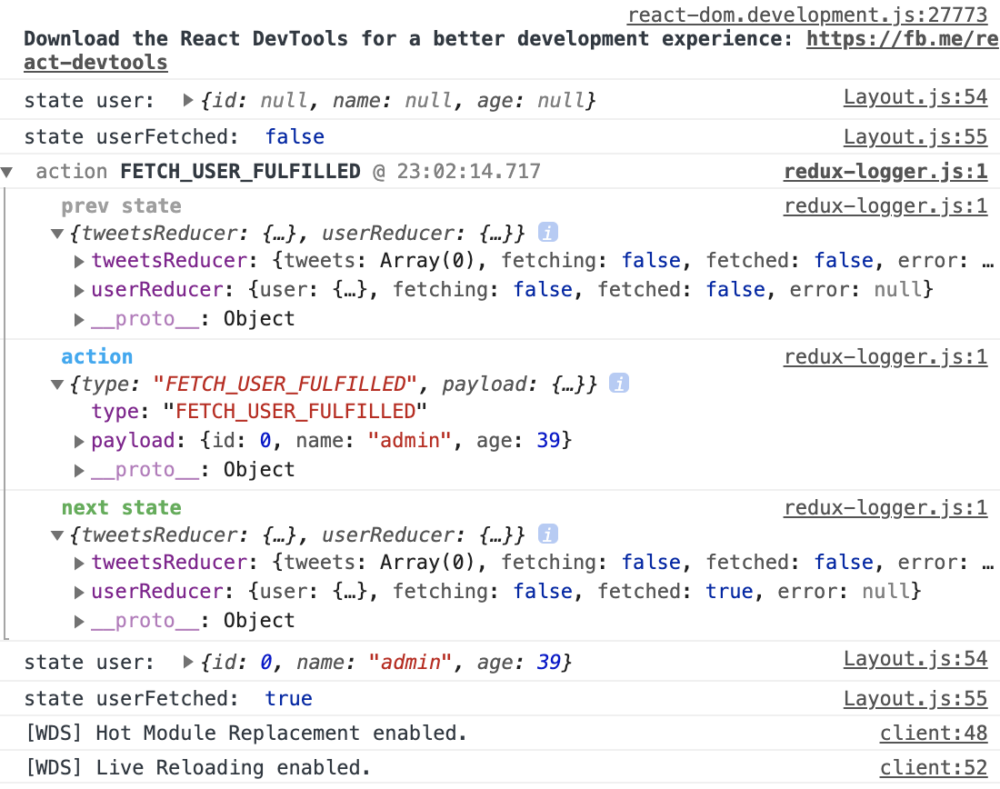

## React+Reduxでアプリケーションを作成してみる

### プロジェクトの作成

```sh:
apple@appurunoMacBook-Pro 2020-02-DockerReact % docker-compose exec app-redux2 sh
/app # npm init -y
/app # npm install --save-dev @babel/core babel-loader \
>         @babel/plugin-proposal-decorators @babel/preset-env @babel/preset-react \
>         webpack webpack-cli webpack-dev-server \
>         react react-dom react-redux react-router react-router-dom \
>         redux redux-logger redux-promise-middleware redux-thunk \
>         babel-plugin-react-html-attrs
>         axios
```
- 前回からの追加で導入しているパッケージ`@babel/plugin-proposal-decorators`は、ES6のdecorator構文を使用するため
- webpack-dev-serverが起動するようにpackage.json に以下のように追記
```json:
  "start": "webpack-dev-server --hot --inline --watch-content-base --content-base src",
```
- `webpack.config.js`を作成する
  <details>
  <summary>webpack.config.js</summary>

  ```js:
  var debug   = process.env.NODE_ENV !== "production";
  var webpack = require('webpack');
  var path    = require('path'); // output.pathに絶対パスを指定する必要があるため、pathモジュールを読み込んでおく

  module.exports = {
    context: path.join(__dirname, "src"), // ビルドの対象となるディレクトリを定義
    entry: "./js/client.js", // webpackがビルドを始める際の開始点となるjsファイル
    // ビルドのメインとなる部分 , ビルドに必要なモジュール（loader）を指定
    module: {
      rules: [{
        test: /\.jsx?$/, // ビルドの対象ファイルを記述, 正規表現を使い全ての.jsまたは.jsxファイル拡張子を対象
        exclude: /(node_modules|bower_components)/, // ビルドから除外するディレクトリを指定, /node_modules/を除外しないと処理が重くなる
        use: [{
          loader: 'babel-loader',  // ビルドで使用するloaderを指定
          options: {
            plugins: [
              /** JSX内でもHTML属性のclassキーワードを使えるようにする */
              'react-html-attrs',
              /** @babel/plugin-proposal-decoratorsでlegacyフラグを付けた場合、引数にクラスとプロパティ名そしてプロパティディスクリプタを受け取り、そのプロパティディスクリプタを加工して返すようになる */
              [require('@babel/plugin-proposal-decorators'), {legacy: true}]
            ],
            /** Reactトランスパイルに使用 */
            presets: ['@babel/preset-react', '@babel/preset-env']
          }
        }]
      }]
    },
    /** 出力先、出力ファイル名 */
    output: {
      path: __dirname + "/src/",
      filename: "client.min.js",
      publicPath: '/'
    },
    /** 開発サーバ設定 */
    devServer: {
      port: 8001, // 8001番ポートを使用
      host: '0.0.0.0', // 外部からのアクセスを許容
      watchOptions: {
        aggregateTimeout: 500,
        poll: 1000
      },
      historyApiFallback: true
    },
    plugins: debug ? [] : [
      new webpack.optimize.OccurrenceOrderPlugin(),
      new webpack.optimize.UglifyJsPlugin({ mangle: false, sourcemap: false }),
    ],
  };
  ```
  </details>

### Reduxエリア部分を作成する

- `src/index.html`の作成を作成する
- アプリのトップページとなる
  <details>
  <summary>src/index.html</summary>

  ```html:
  <!DOCTYPE html>
  <html>
    <head>
      <meta charset="utf-8">
      <title>React Tutorials</title>
      <!-- change this up! http://www.bootstrapcdn.com/bootswatch/ -->
      <link href="https://maxcdn.bootstrapcdn.com/bootswatch/3.3.6/cosmo/bootstrap.min.css" type="text/css" rel="stylesheet"/>
    </head>

    <body>
      <div id="app"></div>
      <script src="client.min.js"></script>
    </body>
  </html>
  ```
  </details>

- `src/js/client.js`を作成する
  <details>
  <summary>src/js/client.js</summary>

  ```js:
  import React from "react"
  import ReactDOM from "react-dom"

  /** ページ(<div id="app"></div>内)全体のレイアウト */
  import Layout from "./components/Layout"

  /** SPAを埋め込む場所 */
  const app = document.getElementById('app')

  /** Layoutコンポーネントをレンダリングする */
  ReactDOM.render(<Layout />, app)
  ```
  </details>

- `src/js/components/Layout.js`を仮で作成する
  <details>
  <summary>src/js/components/Layout.js</summary>

  ```js:
  import React from "react"

  export default class Layout extends React.Component {
    render () {
      /** 仮でnullを返すようにしている何もないコンポーネント */
      return null
    }
  }
  ```
  </details>

- `src/js/store.js`を作成する
- storeはアプリケーションに一つだけ存在する
  <details>
  <summary>src/js/store.js</summary>

  ```js:
  import { createStore, applyMiddleware } from "redux"

  /** logを記録するReduxミドルウェア */
  import { createLogger } from "redux-logger"
  /** Actionsをプレーンなオブジェクトではなく関数を与えられるようにする */
  import thunk from "redux-thunk"
  /** Promiseの処理をきれいに描けるようにする */
  import { createPromise } from 'redux-promise-middleware'
  const promise = createPromise({ type: { fulfilled:'success' }})

  /** Reducerおさらい: Actionをを引数として受取り、stateをどう更新するかを定義 */
  import reducer from "./reducers"

  /** applyMiddlewareは可変長引数を受け取れるのでいくつでもMiddlewareを引数に取れる */
  const middleware = applyMiddleware(promise, thunk, createLogger())

  /** StoreにReducerとMiddlewareを登録する */
  export default createStore(reducer, middleware)
  ```
  </details>

- `src/js/reducers/index.js`を作成する
- 複数のReducerを読み込み、統合するファイル
  <details>
  <summary>src/js/reducers/index.js</summary>

  ```js:
  import { combineReducers } from "redux"

  import tweetsReducer from "./tweetsReducer"
  import userReducer from "./userReducer"

  export default combineReducers({
    tweetsReducer,
    userReducer
  })
  ```
  </details>

- `src/js/reducers/tweetsReducer.js`と`src/js/reducers/userReducer.js`を作成する
- それぞれ、与えられたActionTypeからどのようにStateをを変更していくかを定義していく
- immutableを意識して、新しい値を設定する場合は常に新しいObjectを生成して返すようにする
  <details>
  <summary>src/js/reducers/tweetsReducer.js</summary>

  ```js:
  export default function reducer(state={
    tweets: [],
    fetching: false,
    fetched: false,
    error: null,
  }, action) {

    switch (action.type) {

      case "FETCH_TWEETS": {
        return { ...state, fetching: true }
      }
      case "FETCH_TWEETS_REJECTED": {
        return { ...state, fetching: false, error: true}
      }
      case "FETCH_TWEETS_FULFILLED": {
        return {
          ...state,
          fetching: false,
          fetched: true,
          tweets: action.payload
        }
      }
      case "ADD_TWEET": {
        return {
          ...state,
          tweets: [ ...state.tweets, action.payload ]
        }
      }
      case "UPDATE_TWEET": {
        const { id, text } = action.payload
        const newTweets = [ ...state.tweets ]
        const tweetToUpdate = newTweets.findIndex(tweet => tweet.id === id)
        newTweets[tweetToUpdate] = action.payload
        return {
          ...state,
          tweets: newTweets
        }
      }
      case "DELETE_TWEET": {
        return {
          ...state,
          tweets: state.tweets.filter(tweet => tweet.id !== action.payload )
        }
      }
      
    }
  }
  ```
  </details>
  <details>
  <summary>src/js/reducers/userReducer.js</summary>

  ```js:
  export default function reducer(state = {
    user: {
      id: null,
      name: null,
      age: null,
    },
    fetching: false,
    fetched: false,
    error: null,
  }, action) {

    switch (action.type) {
      case "FETCH_USER": {
        return { ...state, fetching: true }; å
      }
      case "FETCH_USER_REJECTED": {
        return { ...state, fetching: false, error: action.payload };
      }
      case "FETCH_USER_FULFILLED": {
        return {
          ...state,
          fetching: false,
          fetched: true,
          user: action.payload
        };
      }
      case "SET_USER_NAME": {
        return {
          ...state,
          user: { ...state.user, name: action.payload }
        };
      }
      case "SET_USER_AGE": {
        return {
          ...state,
          user: { ...state.user, age: action.payload }
        };
      }
    }

    return state;
  }
  ```
  </details>


- `src/js/actions/userActions.js`と`src/js/actions/tweetsActions.js`を作成する
- Actionにはstateを変更するための関数が用意されている
- ※今回、fetchUser関数の返り値は固定にしているが、本来なら外部のAPIから取得したものを返す
- これらのファイルには複数の関数を定義する予定なので、`named exports`で定義している
  - `named exports`: モジュールは前言の先頭にexportとつけることで、複数のモジュールをexportすることができる
    ```js:lib.js
      export const sqrt = Math.sqrt // 平方根を返す標準ライブラリ
      export function square(x) { return x * x }
      export function diag(x,y) { return sqrt(square(x) + square(y)) }
    ```
    ```js:main.js
      // それぞれの関数をインポートするやり方
      import { square. diag } from "lib"
      console.log(square(11)) 
      console.log(diag(3,4)) 
      // モジュール全体をインポートして、プロパティ表記法で参照するやり方
      import * as lib from "lib"
      console.log(lib.square(11)) 
      console.log(lib.diag(3,4)) 
    ```
    - [詳しくみる](https://qiita.com/senou/items/a2f7a0f717d8aadabbf7)

  <details>
  <summary>src/js/actions/userActions.js</summary>

  ```js:
  export function fetchUser() {
    return {
      type: "FETCH_USER_FULFILLED",
      payload: {
        id: 0,
        name: 'admin',
        age: 39
      }
    }
  }

  export function setUserName(name) {
    return {
      type: "SET_USER_NAME",
      payload: name
    }
  }

  export function setUserAge(age) {
    return {
      type: "SET_USER_AGE",
      payload: age
    }
  }
  ```
  </details>

  <details>
  <summary>src/js/actions/tweetsActions.js</summary>

  ```js:
  import axios from "axios"

  export function fetchTweets() {
    return function (dispatch) {
      dispatch({ type: "FETCH_TWEETS" })
      
      axios.get("http://localhost:18080")
        .then((response) => {
          dispatch({type: "FETCH_TWEETS_FULFILLED", payload: response.data})
        })
        .catch((err) => {
          dispatch({type: "FETCH_TWEETS_REJECTED", payload: err})
        })
    }
  }

  export function addTweet(id, text) {
    return {
      type: "ADD_TWEET",
      payload: { id, text }
    }
  }

  export function updateTweet(id, text) {
    return {
      type: "UPDATE_TWEET",
      payload: { id, text }
    }
  }

  export function deleteTweet(id) {
    return { type: 'DELETE_TWEET', payload: id};
  }
  ```
  </details>

### Reduxに接続する

- Reduxに接続するためには`react-redux`をインストールしておく必要がある
- インストールしたら、トップレベルコンポーネント(`src/js/client.js`)を下記のように修正する
  - `react-redux`の読み込み
  - `react-redux`をwrapする
  - 作成したstoreのインポート
  - storeをProviderコンポーネントのpropsとして定義

<details>
<summary>src/js/client.js</summary>

```js:
import React from "react"
import ReactDOM from "react-dom"

import { Provider } from "react-redux"

/** ページ(<div id="app"></div>内)全体のレイアウト */
import Layout from "./components/Layout"
import store from "./store"

/** SPAを埋め込む場所 */
const app = document.getElementById('app')

/** Layoutコンポーネントをレンダリングする */
// ReactDOM.render(<Layout />, app)
ReactDOM.render(
  <Provider store={ store }>
    <Layout />
  </Provider>, app)
```
</details>

- 以上で、接続部分が改修完了 = 様々なcomponentからstoreが変更されたことを検知して随時画面をレンダリングする準備ができた

### コンポーネントの作成

**storeをprops経由で呼び出してみる**
- 仮で作成していた`/src/js/components/Layout.js`を完成させて、レンダリング処理を記述する
- client.jsとは別のコンポーネントでReduxを使用する場合は、`connect`をインポートする必要がある

```js:
import React from "react"
import { connect } from "react-redux"

@connect()
export default class Layout extends React.Component {
  render () {
    /** 仮でnullを返すようにしている何もないコンポーネント */
    return null
  }
}
```
- @で続く記述はデコレータ
- package.jsonの`babel-plugin-transform-decorators-legacy`パッケージによって変換されるのでwebpack.config.jsで有効にしておく必要がある
- VSCODE上だとWarningが出るが、消すためにはプロジェクト直下に`jsconfig.json`を配置しておく必要がある
  ```json:
  {
    "compilerOptions": {
      "experimentalDecorators": true
    }
  }
  ```
  - 上記のファイルを配置した後、VSCODEをリロードすると警告が消える
- このconnectデコレータは、ReactとReduxStoreを接続する役割を持っている
- 引数にstateをpropsと対応づける関数と、dispatchをpropsに対応づける関数を指定することができる
- そして、connectデコレータで実行される一つ目の関数はpropsとしてstoreの値を取得する関数であり、返り値としてstateのkeyを指定することで、connectされたクラスのthis.propsからstateの値を取得することができる

<details>
<summary>src/js/components/Layout.js</summary>

```js:
import React from "react"
import { connect } from "react-redux"

@connect((store)=>{
  return {
    user: store.userReducer.user
  }
})
export default class Layout extends React.Component {
  render () {
    console.log(this.props.user)
    return null
  }
}
```
</details>

- Layoutコンポーネントのクラス内でthis.propsを通じて、userオブジェクトが出力されているこをが確認できる
- このオブジェクトは`src/js/reducers/userReducer.js`で定義したものになる

**ActionCreatorをprops経由で呼び出してみる**
- user情報の取得も行ってみる

<details>
<summary>src/js/components/Layout.js</summary>

```js:
import React from "react"
import { connect } from "react-redux"

import { fetchUser } from "../actions/userActions"

@connect((store)=>{
  return {
    user: store.userReducer.user,
    userFetched: store.userReducer.fetched
  }
})
export default class Layout extends React.Component {
  componentDidMount() {
    this.props.dispatch(fetchUser())
  }
  render () {
    console.log(this.props.user)
    console.log(this.props.userFetched)
    return null
  }
}
```
</details>

- 下記の通り、dispatch前と後でstateが変わっていることが確認できる
  
- fetchUser()関数は、actionType(type: "FETCH_USER_FULFILLED")なオブジェクトを返す関数なので、それがdispatcherに渡されてreducerが実行される
- このfetchUser()関数のことを`ActionCreator`と呼ぶ
- つまり、これまでに作成していた`actions`ディレクトリ内の関数群は、`ActionCreator`の集まり
- actionTypeなオブジェクトを処理するのは、dispatcherを経由したReducerなので、`src/js/reducers/userReducer.js`に書いてある
- あとは、render()メソッドで`return <h1>{this.props.user.name}</h1>`のようにHTMLレンダリングの処理を書けばstateが画面に表示される

**非同期な処理も経由してみる**
- Layoutコンポーネントで非同期なTweets情報の取得を行ってみる
- まずは、別のターミナルでダミーサーバーを立てる
```sh:
/app # node
> var http = require('http');
undefined
> http.createServer(function (req, res) {
...   res.writeHead(200, {'Content-Type': 'application/json', 'Access-Control-Allow-Origin': '*'});
...   setTimeout(() => res.end('[{"id": 0, "text": "My first tweet."}, {"id": 1, "text": "Good afternoon."}]'), 1000);
... }).listen(18080);
```
- 続いて、StoreのStateであるTweetsをコンポーネント内のProps経由で使用できるように、@connectに処理を追記
- ActionCreatorであるfetchTweetsを読み込み
- Tweets配列が空の場合は、fetch用のボタンを表示して、空でなければ一覧として表示する処理を追加する

<details>
<summary>src/js/components/Layout.js</summary>

```js:
import React from "react"
import { connect } from "react-redux"

import { fetchUser } from "../actions/userActions"
import { fetchTweets } from "../actions/tweetsActions"

@connect((store)=>{
  return {
    user: store.userReducer.user,
    userFetched: store.userReducer.fetched,
    tweets: store.tweetsReducer.tweets
  }
})
export default class Layout extends React.Component {
  componentDidMount() {
    this.props.dispatch(fetchUser())
  }
  fetchTweets() {
    this.props.dispatch(fetchTweets())
  }
  render () {
    const { user, tweets } = this.props
    console.log(tweets)
    if (! tweets.length) return <button onClick={this.fetchTweets.bind(this) } >Tweetを読み込む</button>
    const mappedTweets = tweets.map((tweet)=> <li key={tweet.id}> {tweet.text} </li>)
    return (
      <div>
        <h1>{user.name}</h1>
        <ul>{mappedTweets}</ul>
      </div>
    )
  }
}
```
</details>

**ロード中のメッセージを表示してみる**
- 本番用のプログラムでこのサーバからのレスポンスを待っている時間に`Loading...`なメッセージを表示させてみる
<details>
<summary>src/js/components/Layout.js</summary>

```js:
import React from "react"
import { connect } from "react-redux"

import { fetchUser } from "../actions/userActions"
import { fetchTweets } from "../actions/tweetsActions"

@connect((store)=>{
  return {
    user: store.userReducer.user,
    userFetched: store.userReducer.fetched,
    tweets: store.tweetsReducer.tweets,
    tweetsFetching: store.tweetsReducer.fetching
  }
})
export default class Layout extends React.Component {
  componentDidMount() {
    this.props.dispatch(fetchUser())
  }
  fetchTweets() {
    this.props.dispatch(fetchTweets())
  }
  render () {
    const { user, tweets, tweetsFetching } = this.props

    if (tweetsFetching === true) return <div>Loading...</div>
    if (! tweets.length) return <button onClick={this.fetchTweets.bind(this) } >Tweetを読み込む</button>
    const mappedTweets = tweets.map((tweet)=> <li key={tweet.id}> {tweet.text} </li>)
    return (
      <div>
        <h1>{user.name}</h1>
        <ul>{mappedTweets}</ul>
      </div>
    )
  }
}
```
</details>

- 予めActionCreatorであるfetchTweets()では、`dispatch({type: "FETCH_TWEETS"})`とdispatchしており、リクエストを送信する前から、リクエストの送信が完了するまでの間に、一時的にstateを変更する処理を実装している
- これを利用することで、ボタンを押してから完了するまでの間を`Loading...`というメッセージを表示している
- `@connect`に、stateの`tweetsFetching`を追加して、レンダリングの条件を追加するだけで実装が完了する
